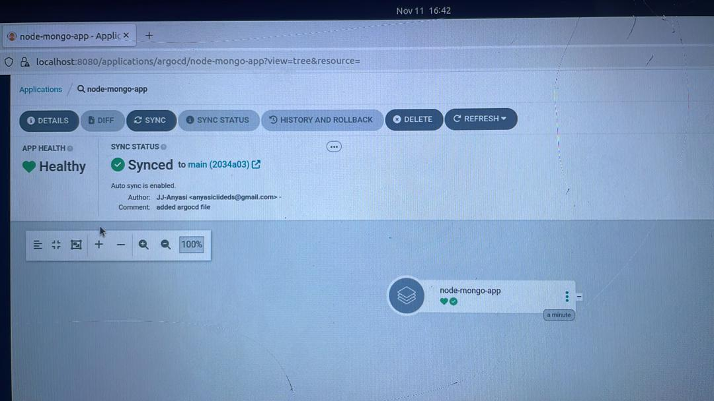
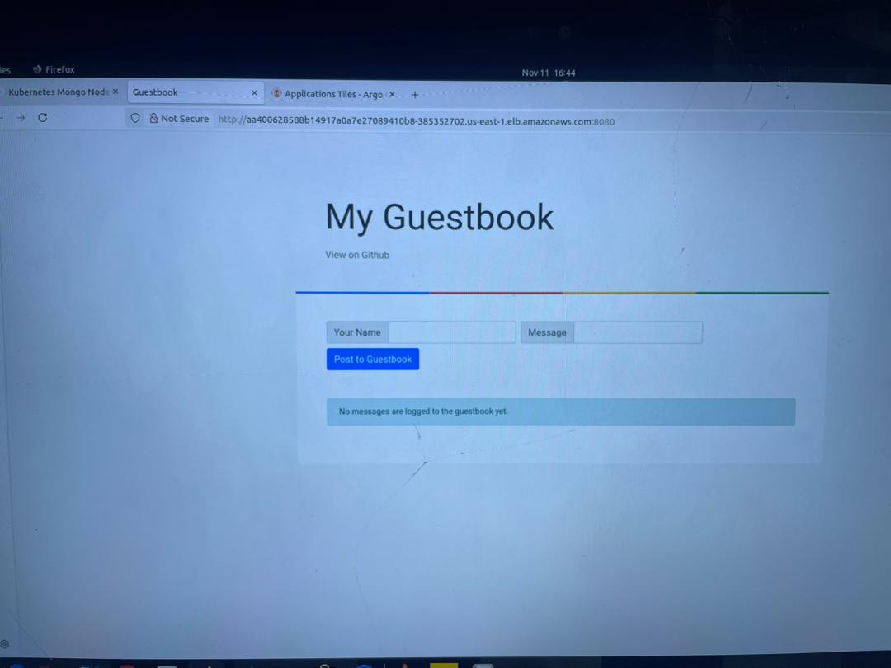
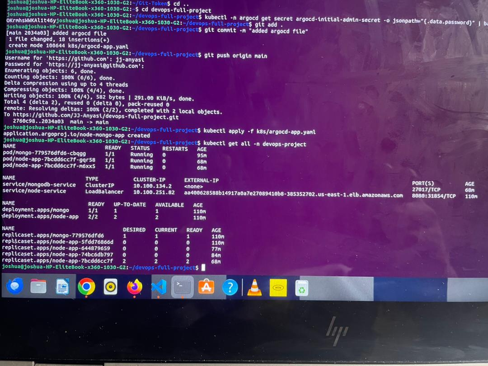
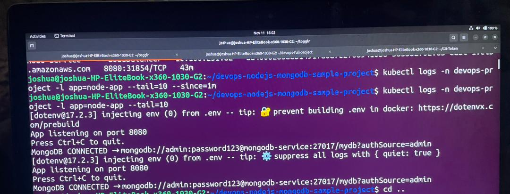

# DevOps Project – Joshua Anyasi

**Live App (was running):**  
http://aa400628588b14917a0a7e27089410b8-385352702.us-east-1.elb.amazonaws.com:8080  

**ArgoCD UI (was running):**  
http://localhost:8080  

**Login:** `admin` / `OKrmhsWWKAl1t46y`  

---

## Project Overview

This is a simple full-stack app (Node.js + MongoDB) deployed on Kubernetes with GitOps automation using ArgoCD.  
The EKS cluster was shut down after everything was verified and working fine.  
All the screenshots, manifests, and proof are saved in this repo.

---

## Tasks Completed

1. Multistage Docker Build – done  
2. Kubernetes Deployment + LoadBalancer – done  
3. MongoDB setup with PVC and `mongodb-service` – done  
4. ArgoCD GitOps Auto-Sync – done  

---

## Process Summary

**Docker:**  
Built a multistage Docker image and pushed it to Docker Hub → `anyasi/node-mongo-app:latest`.

**Kubernetes:**  
Deployed:  
- `node-app` (2 replicas) with a LoadBalancer service  
- `mongo` deployment with `mongodb-service` and an 8Gi PVC  

**ArgoCD:**  
- Set up GitOps sync from this repo  
- Auto-deploys on `git push`  
- Achieved green “Synced” + “Healthy” status  

**Testing:**  
- App was live in browser  
- MongoDB connection confirmed via logs  
- All pods running fine (`1/1 Running`)  

---

## Proof of Work

**ArgoCD UI – Synced and Healthy**  

**Live App – Tested in Browser**  

**Kubernetes Resources (`kubectl get all`)**  

**MongoDB Logs – Connection Successful**  

> The EKS cluster has been shut down after successful verification.  
> All artifacts and screenshots are available in this repo.

---

*Joshua Anyasi*  
*November 11, 2025*